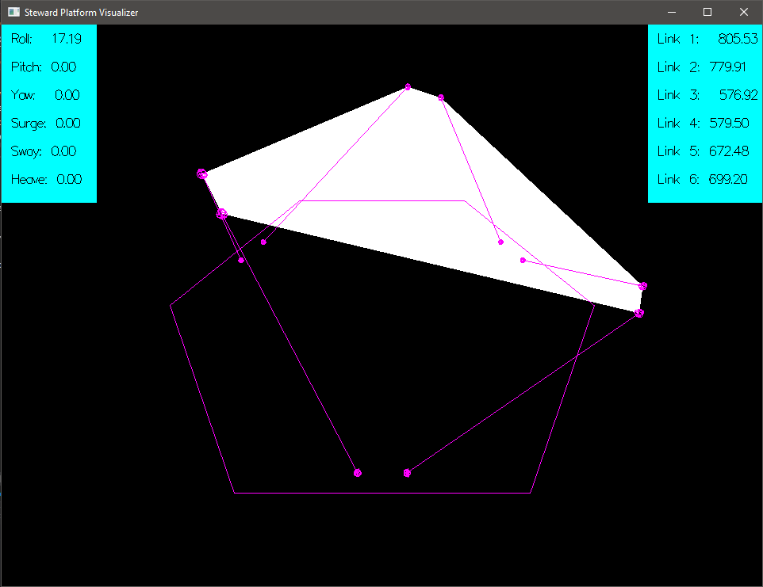

# Steward Platform Visualizer
A simple openGL based steward platform visualizer and inverse kinematic solver.

* Expects angles in radians
* Default MMF path: `Local\\motion_ctrl_mid_vals`
* File structure:
```
struct SPageFileInputs {
    float roll; // in radians
    float pitch; // in radians
    float yaw; // in radians
    float surge; // x; // mm
    float sway; // y; // mm
    float heave; // z; // mm
};
```

